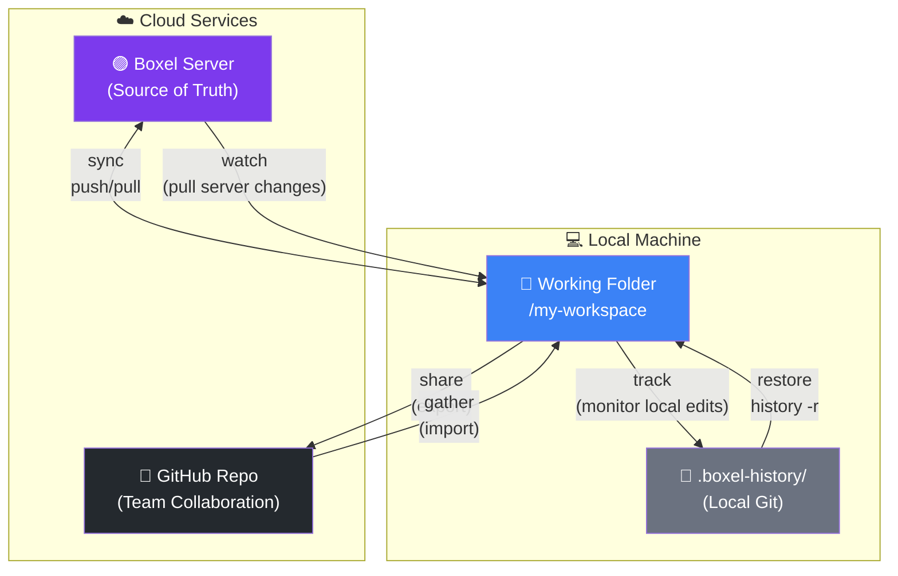

# Boxel CLI

**Bidirectional sync between your local command line agent and [Boxel](https://boxel.ai) workspaces.**

Edit Boxel cards locally with your IDE or AI agent, sync changes instantly, and collaborate seamlessly between web UI and local development.

> **Note:** Boxel CLI is developed and tested with [Claude Code](https://claude.ai/code). For the best experience, install Claude Code first and let it guide you through setup.

---

## Terminology: Realm vs Workspace

Boxel CLI uses two related but distinct terms:

- **Realm** — Server-side concept. A realm is the data store on the server that holds files, cards, and indexes. Use "realm" when talking about server operations, repair, and configuration. Commands: `boxel realms`, `boxel doctor repair-realm`.
- **Workspace** — User-interface concept. A workspace is how users interact with realms through the Boxel web UI. Matrix manages the user's workspace list. Commands: `boxel workspace-list`, `boxel create`.

| Context | Term | Example |
|---------|------|---------|
| Server data store | Realm | `.realm.json`, `boxel realms add` |
| UI workspace picker | Workspace | `boxel workspace-list`, `boxel create` |
| Local config for multi-realm dev | Realm | `.boxel-workspaces.json` |
| Matrix account data | Workspace | `app.boxel.realms` workspace list |

---

## Installation

### Platform Support

Boxel CLI supports:
- macOS
- Linux
- Windows (PowerShell / Command Prompt)

Requirements:
- Node.js 18+
- Git

For `boxel share` PR creation, install GitHub CLI (`gh`):
- Windows: `winget install GitHub.cli`
- macOS: `brew install gh`
- Linux: see [cli.github.com](https://cli.github.com/)

```bash
git clone https://github.com/cardstack/boxel-cli.git
cd boxel-cli
npm install && npm run build
```

Now you can use `npx boxel` (or `boxel` after `npm link`):

```bash
npx boxel profile add              # Set up your account
npx boxel workspace-list           # List your workspaces
npx boxel pull <workspace-url>     # Pull a workspace to ~/boxel-workspaces/
```

### With Claude Code (Recommended)

If you have [Claude Code](https://docs.anthropic.com/en/docs/claude-code) installed, just start it in the repo:

```bash
claude
```

Claude will detect the Boxel CLI project and guide you through setup automatically.

### Global Command (Optional)

To use `boxel` directly without `npx`:

```bash
npm link
boxel profile add
boxel workspace-list
boxel sync .
```

---

## Features

- **Bidirectional Sync** - Push local changes, pull remote updates, resolve conflicts
- **Track Mode** - Auto-checkpoint local edits as you type in your IDE
- **Watch Mode** - Auto-pull server changes with configurable polling
- **Checkpoint History** - Git-based undo/restore with automatic snapshots
- **Multi-Realm Support** - Manage multiple workspaces (code + data separation)
- **GitHub Integration** - Share/gather for team collaboration via PRs
- **Claude Code Integration** - AI-assisted development with Boxel skills
- **Edit Locking** - Prevent overwrites while editing locally
- **Profile Management** - Switch between production and staging environments

## Architecture: Two Git Models

Boxel CLI uses git in **two fundamentally different ways**:

1. **Checkpoint System** (`.boxel-history/`) - Local-only git for undo/restore. Single-user, no remotes, continuous backup. Combined with server sync, can also act as a checkpoint / undo system for hosted Boxel usage.
2. **GitHub Collaboration** (`share`/`gather`) - Traditional branch/merge/PR workflow for team collaboration.

This separation is intentional: **Boxel Server is the source of truth** for your realm, not git.



### Why Two Git Models?

| Aspect | `.boxel-history/` (Checkpoints) | GitHub (Collaboration) |
|--------|--------------------------------|------------------------|
| **Purpose** | Undo/restore safety net | Team code review & merge |
| **Scope** | Single user | Multiple collaborators |
| **Remote** | None (local only) | GitHub origin |
| **Workflow** | Automatic on sync/watch | Manual share/gather |
| **Branches** | Single linear history | Feature branches + PRs |
| **Source of truth** | Boxel Server | Boxel Server (via gather→sync) |

### The Flow

```
┌─────────────────────────────────────────────────────────────────┐
│  INDIVIDUAL WORKFLOW (You + Boxel)                              │
│                                                                 │
│   Boxel Web UI ◄───────► Boxel Server ◄────────► Local IDE     │
│       edit           sync/push/pull              edit           │
│                            │                       │            │
│                   watch ◄──┘                       │            │
│               (pull server changes)                │            │
│                                                    │            │
│                                              track │            │
│                                       (local edits)│            │
│                                                    ▼            │
│                                            .boxel-history/      │
│                                          (checkpoint/restore)   │
└─────────────────────────────────────────────────────────────────┘
                                 │
                    share ↓     ↑ gather
                                 │
┌─────────────────────────────────────────────────────────────────┐
│  TEAM WORKFLOW (Collaboration via GitHub)                       │
│                                                                 │
│   Developer A ──► branch ──► PR ──► review ──► merge           │
│   Developer B ──► gather ◄────────────────────┘                │
│                     │                                           │
│                     ▼                                           │
│              sync --prefer-local                                │
│                     │                                           │
│                     ▼                                           │
│               Boxel Server                                      │
└─────────────────────────────────────────────────────────────────┘
```

**Key insight:** Git is NOT the source of truth. Boxel Server is. Git serves two separate roles:
- **Locally:** Time machine for your work (checkpoints)
- **GitHub:** Collaboration layer for team publishing

---

## Authentication

### Option 1: Profile Manager (Recommended)
```bash
boxel profile add                    # Interactive setup (recommended)
boxel profile list                   # Show profiles (★ = active)
boxel profile switch username        # Switch profile

# Non-interactive (CI/automation only - avoid in shell history)
BOXEL_PASSWORD="pass" boxel profile add -u @user:boxel.ai -n "Prod"
```

> **Security Note:** Avoid passing passwords directly via `-p` flag as they may be exposed in shell history and process listings. Use the interactive wizard or environment variables for credentials.

Profiles stored in `~/.boxel-cli/profiles.json`

### Option 2: Environment Variables
```env
# Production (app.boxel.ai)
MATRIX_URL=https://matrix.boxel.ai
MATRIX_USERNAME=your-username
MATRIX_PASSWORD=your-password

# Staging (realms-staging.stack.cards)
MATRIX_URL=https://matrix-staging.stack.cards
MATRIX_USERNAME=your-username
MATRIX_PASSWORD=your-password
```

---

## Commands Reference

### Sync Operations

**Pull, Push, and Sync relationship:**

| Command | Direction | Purpose | Deletes Local | Deletes Remote |
|---------|-----------|---------|---------------|----------------|
| `pull` | Remote → Local | Fresh download | with `--delete` | never |
| `push` | Local → Remote | Deploy changes | never | with `--delete` |
| `sync` | Both ways | Stay in sync | with `--prefer-remote` | with `--prefer-local` |

```bash
boxel sync .                      # Bidirectional sync (interactive)
boxel sync . --prefer-local       # Keep local on conflicts, sync deletions to server
boxel sync . --prefer-remote      # Keep remote on conflicts
boxel sync . --prefer-newest      # Keep newest by timestamp
boxel sync . --delete             # Sync deletions both ways
boxel sync . --dry-run            # Preview only

boxel push ./local <url>                      # One-way push (local → remote)
boxel push ./local <url> --delete             # Push and remove orphaned remote files
boxel push ./local <url> --batch              # Atomic batch upload (10 files per batch)
boxel push ./local <url> --batch --batch-size 25  # Custom batch size
boxel pull <url> ./local                      # One-way pull (remote → local)
```

> **Note:** `boxel pull` writes `.boxel-sync.json` automatically after a fresh download, so you can run `boxel sync .` immediately against a freshly-pulled workspace with no extra setup.

> **`--batch` mode** (push only): `.gts` definitions upload individually in dependency order, then `.json` instances batch through the server's `/_atomic` endpoint in groups of N. Meaningfully faster on big pushes (50+ files) and reduces UI flashing during server re-indexing. Binary files (images, fonts) and plain-text files (`.md`, `.csv`, `.yaml`) are routed to per-file POST regardless of mode, because `/_atomic` only accepts card and source resource types.

**Failed download cleanup:** When `sync` encounters files that return 500 errors (broken on server), it will prompt you to delete them:
```
⚠️  3 file(s) failed to download (server error):
   - Staff/broken-card.json
   - Student/corrupted.json

These files may be broken on the server. Delete them from remote? [y/N]
```

> **Safety tip:** Before any destructive operation (deleting files, restoring checkpoints), create a checkpoint with a descriptive message:
> ```bash
> boxel history . -m "Before cleanup: removing broken server files"
> ```

### Track & Watch

```bash
# Track LOCAL file changes (checkpoint as you edit in IDE)
boxel track .                     # Track local edits, auto-checkpoint
boxel track . --push              # Track AND push to server (real-time sync)
boxel track . -d 5 -i 30          # 5s debounce, 30s min between checkpoints
boxel track . -q                  # Quiet mode
boxel track . -v                  # Verbose mode (debug output)

# Watch REMOTE server changes (pull external updates)
boxel watch .                     # Watch single workspace (30s default)
boxel watch . ./other-realm       # Watch multiple realms
boxel watch                       # Watch all configured realms
boxel watch . -i 5 -d 3           # 5s interval, 3s debounce
boxel watch . -q                  # Quiet mode

# Stop all watchers and trackers
boxel stop                        # Stops all running watch (⇅) and track (⇆) processes

boxel status .                    # Show sync status
boxel status --all                # All workspaces
boxel status . --pull             # Auto-pull changes
```

**Track vs Watch:**
| Command | Symbol | Direction | Purpose |
|---------|--------|-----------|---------|
| `track` | ⇆ | Local → Checkpoints | Backup your IDE edits as you type |
| `track --push` | ⇆→ | Local → Server | Real-time sync with batch upload |
| `watch` | ⇅ | Server → Local | Pull external changes from Boxel web UI |

### History & Checkpoints

```bash
boxel history .                   # View checkpoint history
boxel history . -r                # Interactive restore
boxel history . -r 3              # Quick restore to #3
boxel history . -r abc123         # Restore by hash
boxel history . -m "Message"      # Create checkpoint with message

boxel milestone . 1 -n "v1.0"     # Mark checkpoint as milestone
boxel milestone . --list          # Show milestones
```

### File Management

```bash
boxel edit . file.gts             # Lock file before editing
boxel edit . --list               # Show locked files
boxel edit . --done file.gts      # Release lock
boxel edit . --clear              # Clear all locks

boxel touch .                     # Force re-index all files
boxel touch . Card/instance.json  # Touch specific file

boxel check ./file.json           # Inspect file sync state
boxel check ./file.json --sync    # Auto-sync if needed
```

### Workspace Management

```bash
boxel workspace-list              # List your workspaces (alias: boxel list)
boxel workspace-list --all-accessible  # Include all accessible realms (even hidden)
boxel workspace-list --hidden     # Only realms not in your UI workspace list
boxel create my-app "My App"      # Create new workspace
boxel remove https://realms-staging.stack.cards/user/my-app/     # Soft remove from your account list
```

### Doctor (Maintenance & Diagnostics)

Rarely-needed maintenance commands live under `boxel doctor`:

```bash
boxel doctor repair-realm <url>         # Repair one realm's .realm.json + index.json
boxel doctor repair-realms              # Batch repair all your realms
boxel doctor consolidate-workspaces      # Fix workspace dirs (defaults to ~/boxel-workspaces/)
boxel doctor force-reindex .            # Force server to re-index files (workaround)
```

**Realm repair** fixes `.realm.json` metadata (name, icon, background) and optionally
repairs `index.json`/`cards-grid.json`. Use `--fix-index` to enable index repair.
Batch mode (`repair-realms`) defaults to config-only repair (no index overwrite).

```bash
# Preview one realm repair
boxel doctor repair-realm https://realms-staging.stack.cards/ctse/odd-sheep/ --dry-run

# Repair with index fix
boxel doctor repair-realm https://realms-staging.stack.cards/ctse/odd-sheep/ --fix-index

# Batch repair all owned realms (config only, no index overwrite)
boxel doctor repair-realms

# Batch repair with explicit options
boxel doctor repair-realms --owner ctse --include-personal --match-endpoint
```

### Multi-Realm Configuration

```bash
boxel realms init                 # Create .boxel-workspaces.json
boxel realms list                 # Show configuration (default)
boxel realms add ./code --purpose "Definitions" --patterns "*.gts" --default
boxel realms add ./data --purpose "Content" --card-types "Post,Product"
boxel realms llm                  # Output file placement guidance
boxel realms remove ./code        # Remove realm
```

### GitHub Workflows

```bash
boxel share . -t /path/to/repo -b branch-name    # Export to GitHub
boxel share . -t /repo -b branch --no-pr         # No auto-PR

boxel gather . -s /path/to/repo                   # Import from GitHub
boxel gather . -s /repo --branch feature          # From specific branch
```

### Skills (AI Instructions)

```bash
boxel skills --refresh            # Fetch skills from Boxel
boxel skills --list               # List available
boxel skills --enable "Name"      # Enable skill
boxel skills --export .           # Export to .claude/commands/
```

---

## Key Workflows

### Active Development (with auto-backup)
```bash
boxel track .                     # Start tracking local edits
# In another terminal or IDE, edit files...
# Checkpoints created automatically as you save

# IMPORTANT: Track creates LOCAL checkpoints only!
# When ready to push changes to Boxel server:
boxel sync . --prefer-local       # Push changes to server
```

**Remember:** `track` does NOT sync to server - it only creates local checkpoints for safety. Always run `sync --prefer-local` when you want your changes live.

### Active Development (with real-time sync)
```bash
boxel track . --push              # Track AND push to server automatically
# Edit files in IDE - changes sync to Boxel server in real-time
```

**With `--push`:** Uses batch upload via `/_atomic` endpoint for efficient multi-file uploads. Definitions (`.gts`) are sorted before instances (`.json`) to ensure proper indexing on the server.

### Active Development (with edit lock)
```bash
boxel edit . my-card.gts          # Lock file (if watch is running)
# ... edit locally ...
boxel sync . --prefer-local       # Push changes
boxel touch . Card/instance.json  # Force re-index
boxel edit . --done my-card.gts   # Release lock
```

### Undo Server Changes (Restore)
```bash
# STOP watch first (Ctrl+C)
boxel history .                   # Find checkpoint
boxel history . -r 3              # Restore to #3
boxel sync . --prefer-local       # CRITICAL: sync deletions to server
```

### Monitor Server While Working
```bash
boxel watch . -i 30 -d 10         # 30s poll, 10s debounce
# Checkpoints created automatically
boxel history .                   # Review what changed
```

### Collaborative with GitHub
```bash
# Share to GitHub
boxel share . -t /path/to/repo -b feature/my-work --no-pr
# Push via GitHub Desktop

# Teammate gathers
boxel gather . -s /path/to/repo --branch feature/my-work
boxel sync . --prefer-local       # Push to Boxel server
```

---

## Critical Patterns

### 0. Checkpoint Before Destructive Operations
**Always create a checkpoint with a descriptive message before:**
- Deleting files from server (`--prefer-local`, `push --delete`)
- Restoring to an earlier checkpoint
- Bulk cleanup operations

```bash
boxel history . -m "Before cleanup: removing sample data"
# Now safe to proceed with destructive operation
boxel sync . --prefer-local
```

This ensures you can always recover if something goes wrong.

### 1. Always Use `--prefer-local` After Restore
```bash
boxel history . -r 3              # Deletes files locally
boxel sync . --prefer-local       # Syncs deletions to server
```
Without this, deleted files won't be removed from server.

### 2. Stop Watch Before Restore
Watch will re-pull deleted files if running during restore.

### 3. Lock Files When Editing Locally
```bash
boxel edit . file.gts             # Lock before editing
# ... edit ...
boxel sync . --prefer-local
boxel edit . --done file.gts      # Release after sync
```

### 4. Touch Instances After Definition Changes
```bash
# After updating card-def.gts remotely
boxel touch . CardDef/instance.json  # Force re-index
```

### 5. Write Source Code, Never Compiled Output
When editing `.gts` files, write clean source code:
```gts
export class MyCard extends CardDef {
  static fitted = class Fitted extends Component<typeof MyCard> {
    <template>
      <div>...</div>
      <style scoped>...</style>
    </template>
  };
}
```
**NEVER** write compiled JSON blocks or base64-encoded imports.

---

## Local Workspace Organization

The CLI stores synced workspaces under `~/boxel-workspaces/` by default, organized by **realm-server-hostname/username/realm**:

```
~/boxel-workspaces/                          # Default root (all platforms)
├── app.boxel.ai/                            # Production realm server
│   └── acme-corp/
│       ├── personal/
│       ├── project-atlas/
│       └── inventory-tracker/
├── realms-staging.stack.cards/              # Staging realm server
│   └── acme-corp/
│       └── sandbox/
└── realms.stack.cards/                      # Production realm server (stack.cards)
    └── acme-corp/
        └── production-app/
```

**Default root:** `~/boxel-workspaces/` on macOS, Linux, and Windows. Override by passing an explicit local path to `pull` or `sync`.

**Benefits:**
- Full realm server URL as folder name eliminates staging/production ambiguity
- Each environment is clearly identifiable by its path
- No collision between realms on different servers

**First-time sync:**
```bash
# The CLI automatically places workspaces under ~/boxel-workspaces/
boxel pull https://app.boxel.ai/username/realm/
boxel pull https://realms-staging.stack.cards/username/realm/

# Or specify an explicit local path to override the default:
boxel pull https://app.boxel.ai/username/realm/ ./my-custom-dir
```

### Profile-Agnostic Local Files

The `.boxel-workspaces.json` config and local directory structure are profile-agnostic by design. Switching profiles changes which remote server you sync with, but all workspaces accumulate on your local machine without conflict. The directory paths encode which realm server they belong to, so there's no need for per-profile configuration.

---

## File Structure

```
workspace/
├── .boxel-sync.json          # Sync manifest (auto-generated)
├── .boxel-history/           # Checkpoint history (git-based)
├── .boxel-edit.json          # Edit locks (auto-generated)
├── .boxel-workspaces.json    # Multi-realm config (optional)
├── .realm.json               # Workspace config
├── index.json                # Workspace index
├── blog-post.gts             # Card definition (kebab-case)
└── BlogPost/                 # Instance directory (PascalCase)
    └── my-post.json          # Instance file
```

### Naming Conventions

| Type | Convention | Example |
|------|------------|---------|
| Definitions | `kebab-case.gts` | `blog-post.gts` |
| Instance dirs | `PascalCase/` | `BlogPost/` |
| Instance files | `kebab-case.json` | `my-first-post.json` |

### Module Paths (Critical!)

The `adoptsFrom.module` path is **relative to the JSON file**:

```json
// In BlogPost/my-post.json:
{
  "data": {
    "meta": {
      "adoptsFrom": {
        "module": "../blog-post",  // Go UP to parent
        "name": "BlogPost"
      }
    }
  }
}
```

| JSON Location | Definition | Module Path |
|--------------|------------|-------------|
| `root/Card.json` | `root/card.gts` | `"./card"` |
| `root/Card/instance.json` | `root/card.gts` | `"../card"` |

### Field Type Rules

| Field Type | In `.gts` use | In `.json` use |
|------------|---------------|----------------|
| Extends `CardDef` | `linksTo` / `linksToMany` | `relationships` |
| Extends `FieldDef` | `contains` / `containsMany` | `attributes` |

---

## Workspace References

Commands accept:
- `.` - Current directory (needs `.boxel-sync.json`)
- `./path` - Local path
- `@user/workspace` - By name (e.g., `@aallen90/personal`)
- `https://...` - Full URL

---

## Checkpoint System

**Classification:**
- `[MAJOR]` - New/deleted files, .gts changes, >3 files
- `[minor]` - Small updates to existing .json files

**Source indicators:**
- `⇆ LOCAL` (green) - Local edits (from `track` command)
- `⇅ SERVER` (cyan) - External change from web UI (from `watch` command)
- `● MANUAL` (magenta) - Restored

**Milestones:** Mark important checkpoints with `boxel milestone`

---

## Conflict Resolution

| Scenario | Flag | Result |
|----------|------|--------|
| Keep local | `--prefer-local` | Overwrite remote, sync deletions |
| Keep remote | `--prefer-remote` | Overwrite local |
| Keep newest | `--prefer-newest` | Compare timestamps |
| Sync deletions | `--delete` | Delete on both sides |
| Interactive | (default) | Prompt for each conflict |

---

## Understanding Boxel URLs

URLs like `https://app.boxel.ai/user/realm/Type/card-id` are **Card IDs**, not fetchable URLs.

| URL Part | Meaning |
|----------|---------|
| `app.boxel.ai` | Production server |
| `user` | User/organization |
| `realm` | Workspace name |
| `Type/card-id` | Card type and instance |

**NEVER use WebFetch** on Boxel URLs (realms are private). Look for local synced copy:
```bash
# Parse: Type/card-id → ./Type/card-id.json
cat ./Type/card-id.json
```

---

## Troubleshooting

| Issue | Solution |
|-------|----------|
| "Authentication failed" | Check `boxel profile`, verify web login works |
| "No workspace found" | Run `boxel workspace-list`, use full URL for first sync |
| Files reverting after restore | Stop watch first, use `--prefer-local` after |
| Watch not detecting changes | Check interval, verify workspace URL |
| Definition changes not reflected | `boxel touch . Instance/file.json` |
| "500 Internal Server Error" on files | Broken on server - sync will prompt to delete, or use `push --delete` |

---

## Development

```bash
npm install                     # Install dependencies
npm run dev -- <command>        # Run CLI in development mode
npm run build                   # Compile TypeScript
npm test                        # Run tests
npm run lint                    # Check code style
```

> **Note:** Use `npm run dev -- <command>` during development (no rebuild needed). After build, use `npx boxel` or `boxel` (after `npm link`).

### Claude Code Integration

This repo includes Claude Code support in `.claude/`:
- `CLAUDE.md` - Project instructions and command reference
- `commands/` - Slash commands (`/watch`, `/restore`, `/sync`, etc.)

When you open this repo in Claude Code, it will guide you through setup and provide AI-assisted development.

---

## Release notes

See [CHANGELOG.md](CHANGELOG.md) for per-version changes.

---

## Contributing

PRs welcome! Please ensure:
- Code passes linting (`npm run lint`)
- New features have documentation
- Breaking changes are noted in PR description
- Add a bullet to `CHANGELOG.md` under the in-progress version (or start a new `## Unreleased` section if one doesn't exist)

---

## License

MIT - See [LICENSE](LICENSE)

---

## Links

- [Boxel](https://boxel.ai) - Main website
- [Discord](https://discord.gg/cardstack) - Community support
- [GitHub Issues](https://github.com/cardstack/boxel-cli/issues) - Bug reports & features
